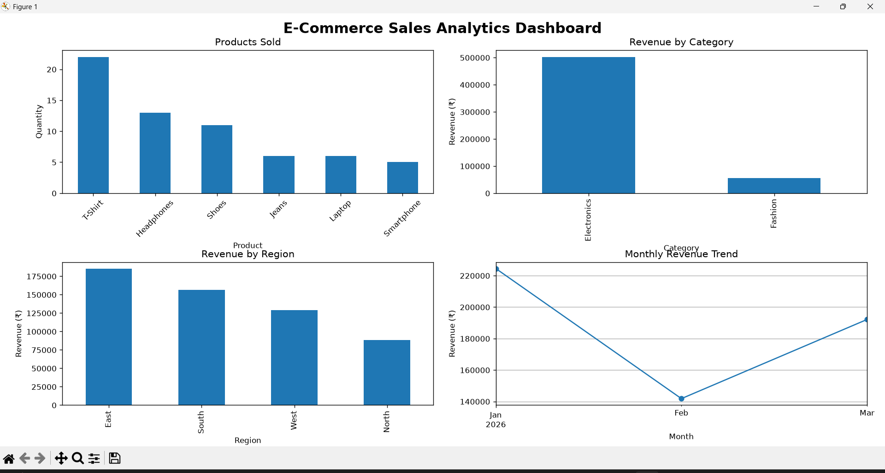

# E-Commerce Sales Analytics 📊

## 📌 Project Overview
This project analyzes e-commerce sales data using Python to understand sales performance, customer behavior, and product trends.

## 🛠️ Technologies Used
- Python
- Pandas
- CSV
- Data Analysis

## 📂 Project Files
- `ecommerce_analysis.py` — Python analysis script
- `ecommerce_sales.csv` — E-commerce sales dataset

## 🔍 Analysis Performed
- Total sales analysis
- Product performance analysis
- Sales trends
- Customer/order analysis
- Basic data exploration

 ## 📊 Key Insights

- T-Shirt is the best-selling product by quantity.
- Electronics generates the highest revenue among categories.
- East region has the highest revenue.
- Monthly revenue shows variation across January, February, and March 2026.
- The analysis helps identify product and regional sales performance.

## 📈 Visualizations

The project includes visualizations for:
- Products Sold
- Revenue by Category
- Revenue by Region
- Monthly Revenue Trend

## 🛠️ How to Run

1. Install Python.
2. Install required libraries:
   `pip install -r requirement.txt`
3. Run the analysis:
   `python ecommerce_analysis.py`

## 👩‍💻 Author

Aliya Amjad
## 📊 Dashboard Preview

